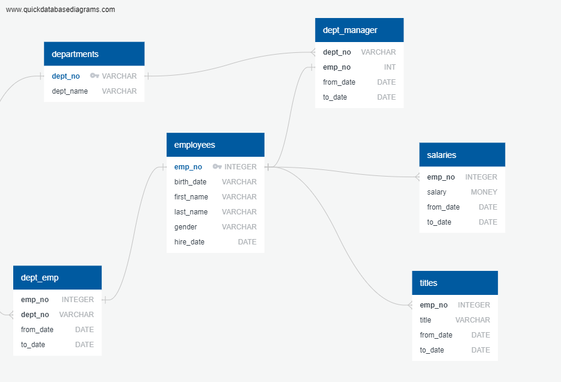

# SQL Challenge - Employee Database: 

This project utilizes SQL and the PostgreSQL database to organize and query employee data.

Initial data consisted of 6 different csv's of employee data.  The data was organized and primary/foreign keys inputted into the web application Quick Database Diagrams to create the ERD below to visualize the table relationships, and to generate the related schema.

After loading in the data and schema into PostgreSQL, the following queries will output the answers to the following questions:

_1. List the following details of each employee: employee number, last name, first name, gender, and salary._   

  *SELECT employees.emp_no, employees.last_name, employees.first_name, employees.gender, salaries.salary
  *FROM employees
  *JOIN salaries
  *ON salaries.emp_no = employees.emp_no;

_2. List employees who were hired in 1986._   

SELECT emp_no, hire_date 
FROM employees 
WHERE hire_date BETWEEN '1986-01-01' AND '1986-12-31';

_3. List the manager of each department with the following information: department number, department name, the manager's employee number, last name, first name, and start and end employment dates._  

SELECT departments.dept_no, departments.dept_name, dept_manager.emp_no, employees.last_name, employees.first_name, dept_manager.from_date, dept_manager.to_date
FROM dept_manager 
JOIN departments
ON departments.dept_no = dept_manager.dept_no
JOIN employees
ON employees.emp_no = dept_manager.emp_no;

_4. List the department of each employee with the following information: employee number, last name, first name, and department name._  

SELECT dept_emp.emp_no, employees.last_name, employees.first_name, departments.dept_name
FROM employees
JOIN dept_emp
ON dept_emp.emp_no = employees.emp_no
JOIN departments
ON departments.dept_no = dept_emp.dept_no;

_5. List all employees whose first name is "Hercules" and last names begin with "B."_  

SELECT first_name, last_name
FROM employees
WHERE first_name = 'Hercules'
AND last_name LIKE 'B%';

_6. List all employees in the Sales department, including their employee number, last name, first name, and department name._  

SELECT dept_emp.emp_no, employees.last_name, employees.first_name, departments.dept_name
FROM employees
JOIN dept_emp
ON employees.emp_no = dept_emp.emp_no
JOIN departments
ON departments.dept_no = dept_emp.dept_no
WHERE departments.dept_name = 'Sales'

_7. List all employees in the Sales and Development departments, including their employee number, last name, first name, and department name._  

SELECT dept_emp.emp_no, employees.last_name, employees.first_name, departments.dept_name
FROM employees
JOIN dept_emp
ON employees.emp_no = dept_emp.emp_no
JOIN departments
ON departments.dept_no = dept_emp.dept_no
WHERE departments.dept_name = 'Sales' 
OR departments.dept_name = 'Development';

_8. In descending order, list the frequency count of employee last names, i.e., how many employees share each last name._  

SELECT last_name, COUNT(last_name) AS "frequency of names"
FROM employees
GROUP BY last_name
ORDER BY "frequency of names" DESC;
